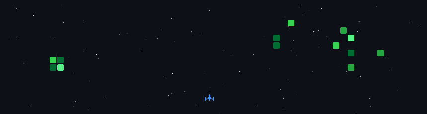

  

<h1 align="center">
   
</h1>

<h3 align="center">A Full-Stack Web Developer & Software Engineer from India 🇮🇳</h3>

   

- 🔭 I’m currently working on **scaling full-stack MERN platforms and Next.js applications with PostgreSQL**

- 🌱 I’m currently learning **Next.js and Advanced Data Structures & Algorithms in Java**

- 📫 How to reach me: **chiragtyagiofficial@gmail.com**

- 👨‍💻 All of my projects are available at [Github](https://github.com/Chiragtyagi01)

- 💬 Ask me about **MERN Stack, Next.js, and Data Structures & Algorithms**

- 📄 Know about my experiences [here](https://www.linkedin.com/in/ichiragtyagi/)
  

<h3 align="left">Connect with me:</h3>

  
  

<h3 align="left">Languages and Tools:</h3>

  
   
   
   

  
 &ensp;<b> Stats </b>

  
  
  
   

  <picture>
    <source media="(prefers-color-scheme: dark)" srcset="game.gif" />
    <source media="(prefers-color-scheme: light)" srcset="game.gif" />
    
  </picture>

  
### ✍️ Random Dev Quote

